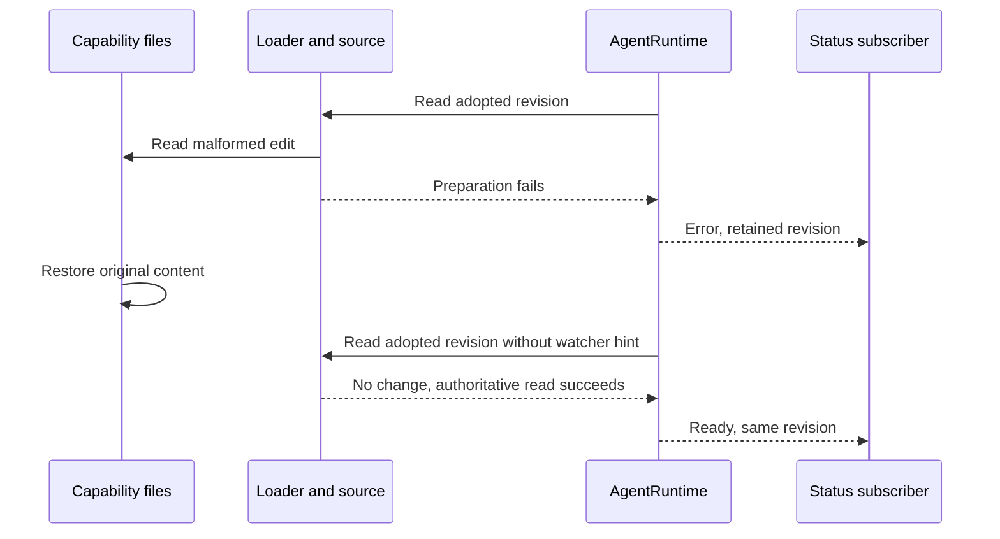

# Capability status recovery

The session `AgentRuntime` owns the adopted capability revision and its refresh
status. A successful authoritative read that returns no new candidate means that
the adopted revision is valid again. It clears a prior refresh error without
requiring a filesystem notification, reconnecting MCP, rebuilding tools, or
changing the revision. Identical ready observations emit no duplicate event.

Acceptance uses a real temporary workspace, manifest/script discovery, bootstrap
source, runtime registry, status subscription, and subprocess execution. It adopts
a script, rejects an invalid edit, runs the retained tool, restores the original
bytes, and confirms ready status and the unchanged callable tool. No watcher is
installed so recovery cannot depend on a change hint. This changes no protocol,
permission, workspace identity, desktop delivery, or mobile replay contract.
