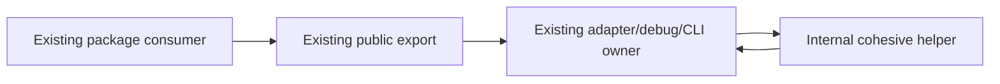

# CLI module boundaries

## Purpose

The CLI workspace keeps implementation files below the repository's 400-line
production-source limit through cohesive module extraction. This is a structural
change only: existing CLI behavior, ordering, error propagation, cancellation,
async ownership, and public package exports remain unchanged.

## Ownership and boundaries

`@zcode/adapters` continues to own Node and provider-facing I/O. Its public
subpath entry points remain the only package boundary used by bootstrap, core,
and the CLI. A large adapter entry module may delegate a single cohesive concern
to a sibling helper, but it remains the owner of its public factory, class, or
function contract.

The debug package continues to own its browser presentation and diagnostic
analysis separately from the CLI package, which owns command parsing and process
entry orchestration. Their extracted helpers are internal siblings; no consumer
may import them as a new public API.

## Preserved contracts

- All existing public exports and export names stay available at their current
  package subpaths.
- Factories, classes, and functions retain their current input, output, error,
  cancellation, and async behavior.
- State remains owned by the same existing object or closure. Helpers receive
  explicit dependencies and must not create a second cache, queue, registry, or
  write path.
- Extraction must not move I/O into callers, change feature flags or gates, or
  alter sequencing of provider, filesystem, MCP, storage, or CLI operations.
- An early `runStreamText()` consumer return continues through the delegated
  attempt and releases its admission ticket exactly once. A preserved provider
  boundary closes; an ordinary provider boundary keeps its existing open
  lifecycle policy.

## Structural gate and acceptance

Every production TypeScript source file touched by this effort must remain at or
below 400 effective lines under the repository `max-lines` rule. The change must
use semantic helpers or focused internal modules, never rule suppression,
threshold changes, ignored files, generated baseline updates, or code
compression.

Acceptance requires the adapter package typecheck and lint to pass, existing
focused feature tests to preserve behavior, and the workspace architecture check
to report no new violations. The broader CLI lint result is reported separately
when unrelated packages still contain structural violations.

The stream extraction acceptance tests close a consumer before natural EOF. The
preserved-boundary case verifies provider closure and one admission release; the
ordinary case verifies the provider remains open while the admission ticket is
still released once.
