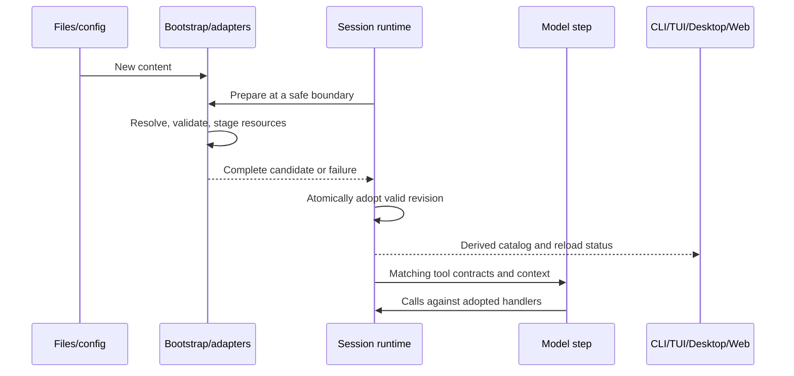

# Live capabilities

## Product contract

CLI/TUI and Desktop use the same AgentRuntime capability owner. A running session
can discover added, edited, disabled and removed tools, skills, plugins and MCP
configuration without restarting. Changes made by a tool become available before
the next model request in that same turn. Idle catalog reads may refresh a session;
reads during a turn return its adopted snapshot and never mutate executing tools.

The implementation is original. The architectural reference is
https://anoma.ly/notes/opencode-reloaded/. Improvements targeted here are staged
validation, generation ordering, observable versions and explicit resource leases.
No comparative performance or cache guarantee is implied.

## Ownership and interfaces

Adapters read files and run external processes. Bootstrap assembles ordered
contributions and stages MCP resources. Core owns adoption, tool registration and
the skill/plugin snapshot. Hosts forward commands and derived views. Renderers and
TUI never independently declare a capability available.

The runtime consumes an optional capability source through a public core contract.
A prepared snapshot carries an opaque content revision, tool entries, a skill
snapshot/port and plugin identities. Preparation has no effects on the published
registry. Commit publishes a coherent revision; release disposes superseded
resources only when their tool calls are no longer using them. Failure retains the
last valid revision. The source and all its resources are disposed with the app.

## Invariants

- Stable ordering and ownership; duplicate extension tool identities are errors.
  Extensions cannot overwrite built-ins or impersonate official MCP capabilities.
- Rebuild from source contributions; deletion removes stale entries and repeated
  reload does not accumulate transformations or handlers.
- Publication happens between complete model/tool steps. A catalog query cannot
  replace handlers used by an active model request. Concurrent refreshes serialize.
- Workspace identity is `workspaceIdentity?.trim() || workspacePath`; path remains
  the filesystem base. No global mutable session registry or cross-host propagation.
- An extension file is data at discovery time. Program execution goes through the
  existing tool executor, permissions, cancellation, execution adapter and budgets.
  Reload never grants permissions or executes arbitrary plugin initialization code.
- Config errors, invalid manifests and failed replacement MCP connections retain
  the last valid environment and expose a bounded diagnostic without credentials.
- A reload error is supplemental to the adopted catalog: a same-authority picker
  keeps its last valid entries visible while it refreshes or reports that error.
  A workspace, session, remote attachment, or service-authority change clears them
  before the replacement response arrives.
- Unchanged revisions avoid reconnecting servers or rebuilding model context.
- Child agents and workflow actors inherit the adopted capability revision at
  creation, including programmable tools. Their own restrictions remain effective;
  they retain that revision's resources until the child runtime is disposed.
- Preserve submitted model/mode overrides, command admission, owner/lease and stale
  run protection. Provider catalogs continue using their existing generation owner.
- MCP input provenance is explicit. A supplied session MCP map is a complete,
  fixed override (including an empty map); missing entries must never be silently
  reintroduced from files. Desktop/Web directory projections carry their original
  base separately from host-resolved runtime values and opt into directory reload.
  A directory source that supplies a resolved map must also supply that raw base;
  a directory source with neither map leaves discovery to the runtime.
  The runtime rereads `.zcode` / `.agents` using the same per-scope precedence.
  Host environment/header deltas and appended workspace arguments are preserved
  only while the raw process/endpoint and its environment/headers remain compatible.
  A changed executable, arguments, process environment, URL or headers never receives
  credentials belonging to the previous configuration. New plugin MCPs retain
  the existing trusted bootstrap augmentation path. Legacy unmarked explicit maps
  retain session override semantics; no per-entry equality guesses determine ownership.
- Manual MCP reconnect uses the adopted generation and workspace identity. MCP
  source files are verified before and after staging a connection so an edit during
  handshake rejects the candidate and preserves the last published generation.
- Desktop continuous and mobile replayable delivery retain their existing transport
  semantics. Capability views are refreshable session-owned projections.

## Programmable tools

Add a versioned declarative local tool manifest with a command entrypoint. Tool
schemas and capability declarations are validated before registration. Input is
passed as JSON, not shell interpolation. Scripts can be written by the agent and
used on the next step; their content participates in revision detection. Both
`.zcode` and `.agents` workspace conventions must be supported. Installed plugin
contributions retain manifest ownership and enable/disable scope. Document exact
paths, schemas and an executable example with the implementation.

## Acceptance

1. A model writes a tool, sees and invokes it on its next request in the same turn.
   Editing changes the result; deleting removes it without restarting.
2. New/edited/removed skills and enabled/disabled plugins are reflected consistently
   in session catalogs and runtime behavior, including idle reads.
3. MCP add/change/remove publishes matching descriptors and handlers. Failed
   replacement preserves the old connection and tools. Old resources drain safely.
4. Duplicate identities, malformed config/schema and unsafe paths fail atomically.
5. Simultaneous reloads cannot publish older data after newer data. Repeated content
   does not churn revisions. Dispose closes watchers/processes/connections.
6. Two workspaces/sessions cannot leak capabilities, and explicit tool restrictions
   and permission denial remain effective after reload.
7. CLI/TUI and protocol/Desktop use the same engine; integration tests exercise
   their actual app/session entry points with deterministic model/IO fixtures.

## Validation

Use Node's test runner with tsx for new focused integration tests where no runner
currently exists. Execute the new tests, CLI package builds/typechecks, root
`pnpm typecheck`, `pnpm lint`, and `pnpm architecture:check --changed`. Independently
review the implementation and inspect final diffs. Report any unavailable live UI
or provider validation separately from deterministic integration evidence.
