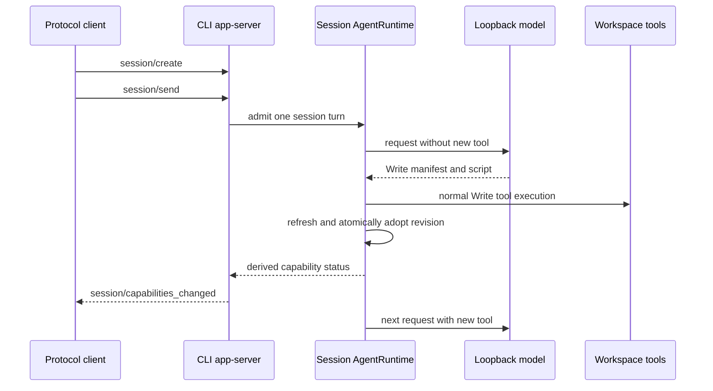

# Live capability protocol acceptance

## Scope

This acceptance scenario verifies the CLI `app-server` entry point over its
NDJSON ZCode Protocol transport. It supplements in-process runtime tests; it
does not replace Desktop or mobile delivery testing.

The fixture runs one isolated app-server process, one temporary workspace and a
loopback OpenAI-compatible test server. The provider receives a non-secret,
fixture-only credential. No request leaves the local machine.

## Ownership and event order

`AgentRuntime` remains the sole owner of the adopted capability snapshot and
resource leases. The protocol server only relays its derived state to the client;
the protocol client must not cache or synthesize a second accepted catalog.

The same session then uses the tool, replaces its script and uses the new
revision, rejects a malformed replacement while retaining the prior revision,
and removes the manifest. Each model request is served by the loopback fixture
so the test can assert the real request's exposed tool list and prior tool
result.

## Acceptance rules

1. The first model request does not list the programmable tool. Its normal
   `Write` calls create the manifest and script in the temporary workspace.
2. The next model request in that same accepted turn lists and invokes the
   created tool. The test observes the real child tool process result.
3. An idle script replacement causes a newer ready capability revision; a later
   turn invokes the new behavior.
4. A malformed manifest produces an error capability notification whose
   revision is the last ready revision. The prior tool remains available and
   callable in a later turn.
5. Deleting the manifest produces a newer ready revision without the tool.
6. The `Write`-triggered capability notification in an accepted turn is a
   protocol sideband frame after that `session/send` response and refers to the
   created session. Initial materialization is observed separately: the current
   server can emit its first capability status before `session/create` responds,
   so a Host must not rely on response-first ordering for that initial status.
   A catalog consumer obtains its initial state after it knows the session id by
   reading the session-scoped Skill or Plugin reference catalog; that response
   refreshes the runtime capability snapshot and includes `capabilityStatus`.
7. Closing stdin after the session is closed exits the app-server within the
   bounded test deadline. The fixture closes its loopback server and removes its
   temporary directory in `finally` blocks.

## Transport and failure boundary

The test uses the shared strict request and notification schemas to construct
and validate frames. It responds to required server-to-client runtime-preference
and permission requests using their normal response shapes; it does not bypass
the broker or call the runtime directly. The model is intentionally
deterministic but the following boundaries are real: CLI process startup, NDJSON
stdin/stdout, provider HTTP request, session protocol operations, `Write`,
capability watching, immutable live-tool snapshot execution, and shutdown.

Desktop's `desktop-continuous` and mobile's `web-remote-replayable` delivery
kinds are separate transport contracts. This scenario establishes only the
shared app-server notification source and legacy protocol ordering; their
replay/resume behavior needs dedicated client-side acceptance coverage. The
capability sideband itself has no replay or snapshot contract, so a reconnecting
client must bootstrap a live-capability catalog with the session-scoped catalog
RPC rather than treating a previously missed sideband notification as state.
