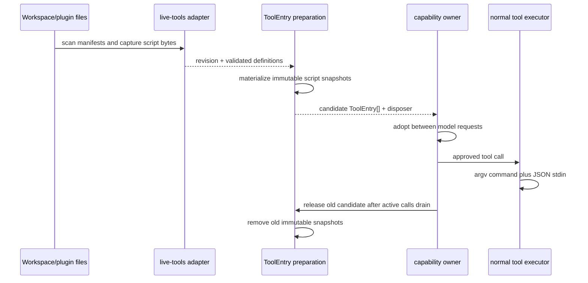

# Live programmable tools

## Scope and ownership

A live tool is a declarative, local command capability. The adapter owns discovery,
validation, content revisioning, captured script bytes, and file-change hints. Bootstrap
owns conversion into normal `ToolEntry` objects. The runtime owns publication, permission
decisions, execution lifetime, and replacement of an adopted capability snapshot.

The loader never imports a plugin module or executes a manifest command. A manifest is
data until the normal tool executor invokes its converted `ToolEntry`.



`loadLiveTools` is a complete, atomic read. It either returns one valid snapshot or
throws a structured `LiveToolConfigurationError`; callers retain their previous adopted
snapshot after a failed read.

## Discovery

`loadLiveTools({ workspacePath, userRoots?, pluginRoots? })` scans these manifest
directories without recursion:

| Owner             | Directory                                                                          |
| ----------------- | ---------------------------------------------------------------------------------- |
| Workspace ZCode   | `<workspacePath>/.zcode/tools/*.json`                                              |
| Workspace agents  | `<workspacePath>/.agents/tools/*.json`                                             |
| User contribution | each directory in `userRoots`                                                      |
| Enabled plugin    | `<plugin package root>/tools/*.json` for each `{ id, path }` item in `pluginRoots` |

An absent directory contributes no tools so a new directory and a deleted directory are
both normal live changes. `pluginRoots` is supplied only for enabled plugins. Each `path`
is the plugin package root supplied by the enabled-plugin resolver, so ordinary package
files such as `package.json` are never treated as manifests; only its `tools` child is
scanned. Its `id` is recorded as the source owner and duplicate plugin ids are rejected.
The loader sorts
owners and manifest file names by code point, so filesystem enumeration order never
selects a winner.

Each manifest `id` and every public tool `name` is unique across the entire snapshot.
There is no override rule: a collision rejects the whole candidate. This preserves stable
ownership and lets the runtime reject a live name that collides with an existing built-in
or MCP tool before it publishes the candidate.

Discovery accepts only direct regular `.json` files. Relative script paths are resolved
from their manifest directory and must stay inside the owning manifest root after both
logical path resolution and `realpath`. Absolute paths, `..` traversal, a manifest
symlink, and a symlink which resolves outside that root are rejected. Command argv
executables are bare command names; local executable paths must use the `script` form.

## Manifest v1

Every manifest is a UTF-8 JSON object with exactly these top-level fields:

```ts
{
  version: 1,
  id: "example.word-tools",
  tools: Array<{
    name: "word_count",
    description: "Counts Unicode whitespace-separated words.",
    inputSchema: JsonSchema,
    outputSchema: JsonSchema,
    command:
      | { argv: ["executable", "fixed", "arguments"] }
      | { script: "./word-count.mjs", args?: ["fixed", "arguments"] }
  }>
}
```

`id` and `name` are non-empty ASCII identifiers made of letters, digits, `.`, `_`, and
`-`; a name starts with a letter. `description` is non-empty text. Every array element is
a string where applicable, and unknown fields are invalid rather than ignored.

`inputSchema` and `outputSchema` use a supported JSON Schema Draft 7 / 2020-12 subset:
`$schema`, `title`, `description`, `default`, `type`, `properties`, `required`,
`additionalProperties`, `items`, `oneOf`, `enum`, `const`, `minLength`, `maxLength`,
`minimum`, `maximum`, `minItems`, and `maxItems`. Schema nodes are JSON values with a
bounded depth and size; unknown keywords, malformed constraints, unresolved `$ref`, and
non-finite values are rejected. Tool input roots must be an object. A command cannot
declare its own permission, read-only status, timeout, or output budget.

The `argv` form runs the first string as the executable and the remaining strings as
fixed arguments. The tool input is never expanded into the command line. The `script`
form is a JavaScript `.js`, `.cjs`, or `.mjs` file. Bootstrap supplies its Node-compatible
runtime explicitly, which supports normal Node, SEA, and Electron hosts without assuming
`process.execPath` is a Node interpreter.

The SEA internal script host dispatches before provider initialization. Its lifetime
follows the script's asynchronous work; the ordinary CLI exit watchdog must not cut
off valid tool execution. The parent executor still owns cancellation and deadlines.
Import or execution failures exit with code 1 and put a bounded diagnostic on
stderr: script filename, error type, useful message, and a source line/column when
the engine supplies one. The diagnostic includes at most three Error causes,
uses the existing shared text redaction policy, and never serializes stdin,
arguments, environment, or arbitrary thrown objects. Stdout remains the tool's
JSON result channel. Integration acceptance invokes the actual CLI entrypoint and
the packaged SEA host through success, broken script, and repaired script states.
The runtime includes concise manifest guidance in model context so agents can create
these capabilities without requiring a preinstalled skill.

## Revision and safety rules

The returned revision is a SHA-256 content fingerprint over ordered owner ids, manifest
relative paths and bytes, and every referenced script path and byte sequence. It never
depends on mtime. Editing a script changes the revision;
deleting a manifest or script changes the candidate and its revision. Re-reading unchanged
content returns the same revision.

The loader captures script bytes during the successful scan. Bootstrap writes those bytes
once to a private immutable snapshot and executes that snapshot, never the mutable source
path. A v1 script is self-contained: relative filesystem imports are not supported because
the immutable snapshot is outside the mutable source directory. The source candidate exposes
an async disposer; the capability owner calls it when
an unpublished candidate is abandoned or after the old candidate's active calls have
drained. Thus an accepted old schema cannot silently run an edited script.

`createLiveCapabilityWatcher(paths, onChange)` is only a wake-up hint. It watches supplied
paths or the nearest existing parent for absent paths, coalesces notifications briefly,
and falls back to non-recursive `fs.watch` behavior on platforms without recursive watch
support. Every wake-up still calls the authoritative loader; no watcher event itself
publishes a capability or establishes correctness.

## Directory MCP resolver

`@zcode/adapters/directory-mcp` exposes
`loadDirectoryMcpServers({ homeDirectory, workspacePath })`. It is an asynchronous,
Desktop-independent projection for a local session source. It returns an effective
`Record<string, McpServerConfig>` and these absolute `watchPaths`, including paths that do
not yet exist:

| Scope     | ZCode source                     | Agents source                  |
| --------- | -------------------------------- | ------------------------------ |
| User      | `<home>/.zcode/cli/config.json`  | `<home>/.agents/mcp.json`      |
| Workspace | `<workspace>/.zcode/config.json` | `<workspace>/.agents/mcp.json` |

Within each scope, a non-empty `mcp.servers` map in the ZCode file selects that source and
blocks the `.agents` `mcpServers` map. Entries count for that decision even when
`enabled: false`. The workspace map then overrides the user map by server name. Disabled
workspace entries are retained through the merge as tombstones, so they suppress a
same-named user server; the returned projection contains only enabled servers.

Each selected file is parsed with the existing ZCode MCP configuration schema, including
legacy `enable` normalization and strict server-field validation. Missing files contribute
no entries. An unreadable, malformed, or invalid existing file rejects the whole resolver
call with `DirectoryMcpConfigurationError`; it never silently falls through to another
source. The resolver is read-only and does not import Desktop code or alter directory files.

## Execution contract

The converted `ToolEntry` uses the existing `ExecutionPort` in `argv` mode. It writes one
JSON representation of the validated tool input to stdin. A command must write exactly
one JSON value to stdout; diagnostics belong on stderr. A nonzero exit, cancellation,
timeout, oversized/truncated stdout, malformed stdout, or output-schema mismatch is a
tool failure.

Every live command, including scripts, has `sideEffectScope: "system"`, `riskLevel: "high"`,
and `needsApproval: true` regardless of any misleading declaration in a source file. They use
the ordinary permission, timeout, cancellation, trace, and result-budget paths. Current
fixed limits are a 30-second execution deadline and 64 KiB stdout/stderr buffers; the
normal executor validates the registered input and output schemas and applies its result
budget after the handler returns.

## Executable example: `word_count`

Create these two files in a workspace. A model can create them in one tool step; the next
model request sees `word_count` after the live capability source refreshes.

`<workspace>/.zcode/tools/word-count.json`:

```json
{
  "version": 1,
  "id": "example.word-tools",
  "tools": [
    {
      "name": "word_count",
      "description": "Counts whitespace-separated words in text.",
      "inputSchema": {
        "type": "object",
        "additionalProperties": false,
        "properties": { "text": { "type": "string" } },
        "required": ["text"]
      },
      "outputSchema": {
        "type": "object",
        "additionalProperties": false,
        "properties": { "count": { "type": "integer", "minimum": 0 } },
        "required": ["count"]
      },
      "command": { "script": "./word-count.mjs" }
    }
  ]
}
```

`<workspace>/.zcode/tools/word-count.mjs`:

```js
const chunks = [];
for await (const chunk of process.stdin) chunks.push(chunk);
const { text } = JSON.parse(Buffer.concat(chunks).toString("utf8"));
const trimmed = text.trim();
process.stdout.write(JSON.stringify({ count: trimmed === "" ? 0 : trimmed.split(/\s+/u).length }));
```

For input `{ "text": "one two three" }`, stdout is `{ "count": 3 }`. Replacing the
script with a different implementation produces a new revision; removing the manifest
removes the tool on the next successful refresh.
