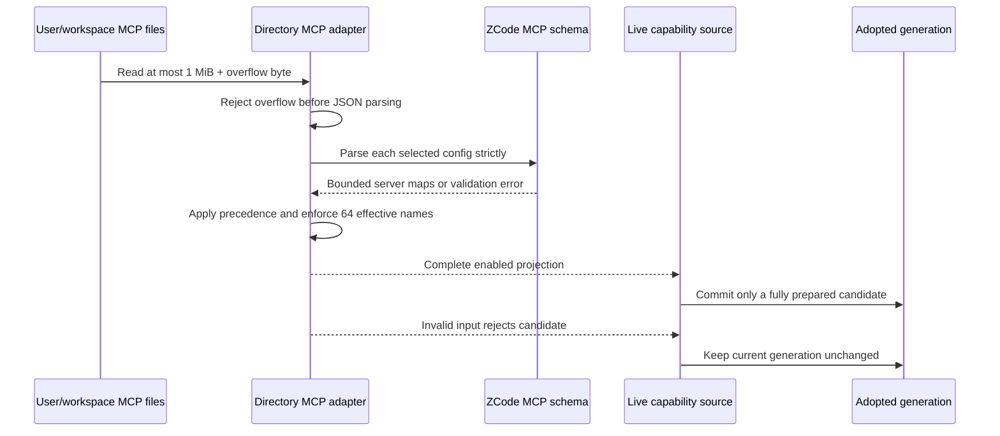

# Directory MCP input limits

## Scope and ownership

The directory MCP adapter owns bounded file reads, strict parsing, and the
effective configuration assembled from user and workspace files. The existing
ZCode MCP schema owns field-level validation shared by file-backed config
inputs. The live capability source owns adoption: it may commit only a complete
candidate returned by the loader. This change does not alter connection-pool
admission or runtime server behavior.

## Limits

- Each selected JSON file is read through a bounded buffer. The adapter reads no
  more than 1 MiB plus one byte, rejects an overflow before `JSON.parse`, and
  never loads an oversized file in full or truncates it.
- A server name is at most 128 JavaScript string code units. A single server's
  normalized JSON value is at most 16 KiB when serialized as UTF-8.
- Strings in MCP server fields are at most 4 KiB in UTF-8. This covers command,
  URL, cwd, arguments, environment/header keys and values, and OAuth strings.
- A stdio argument array contains at most 64 strings. Environment and header
  maps contain at most 32 entries each.
- Each parsed source map and the final user/workspace merge contain at most 64
  server names. The combined count is measured after workspace entries replace
  same-named user entries and before disabled entries are filtered out, so
  disabled tombstones remain valid inputs and still consume one name.

Existing `.zcode`-over-`.agents` selection, workspace-over-user precedence,
legacy normalization already defined by the schema, strict unknown-field
rejection, and disabled tombstone behavior remain unchanged. In particular,
unknown or over-limit data does not fall back to another source.

## Failure behavior

An oversized file, excessive server count, overlong name, field, array or map,
or oversized server value rejects the entire directory MCP candidate with
`DirectoryMcpConfigurationError` and code `invalid_config`. The adapter does
not skip a bad server, retain only valid siblings, or truncate input. When used
by `createLiveCapabilitySource`, a rejected candidate is never connected or
committed; the previously adopted generation remains available until a complete
replacement succeeds.

Missing files remain normal empty sources. Other filesystem failures retain the
existing `unreadable_config` error behavior. These limits are validation bounds
for directory configuration; they do not add another source, legacy fallback,
or pool policy.

## Acceptance

- A real file up to 1 MiB can be parsed; a file larger than 1 MiB is rejected
  before JSON parsing.
- A configuration with at most 64 names after cross-scope precedence is
  accepted even if some names are disabled tombstones; a merged candidate with
  65 effective names is rejected, including disabled names in the count.
- A valid stdio fixture using supported fields such as `protocolVersion`,
  `timeoutMs`, `command`, and `args` reaches the live MCP source and can be
  called.
- Over-limit server values, strings, argument arrays, or maps reject the whole
  candidate without replacing the active generation.
- Restoring the original files allows the same source to prepare and adopt the
  original configuration again.
