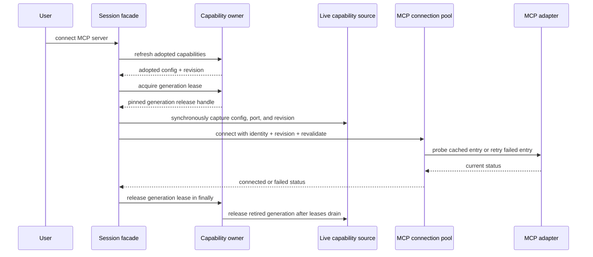

# Manual MCP recovery

## Contract

`connectMcpServer` is an explicit user request to recover one configured MCP
server. Bootstrap first refreshes live capabilities, then immediately acquires a
lease on the adopted runtime generation. While holding that lease, it captures
the server configuration, MCP port, and revision synchronously and connects with
those values. A `finally` block releases the generation lease after the connection
attempt settles, including configuration and connection errors. It also requests
pool revalidation so a cached failed connection is retried and a connected one is
probed before reuse.

The pool remains the sole owner of connection entries. Revalidation happens on
the existing entry when its identity matches, preserving workspace sharing and
lease references. A changed config, identity, or capability revision still uses a
different entry. Concurrent recovery requests for the same entry share one
revalidation attempt. Cancellation and pool shutdown retain their existing
drain/close behavior.

## Acceptance

- A failed server can recover through the facade without changing its config or
  revision; the adapter receives a second connection attempt.
- A healthy workspace-shared entry is probed and remains shared by its leases.
- The facade never retries using a config or revision from a candidate that was
  not adopted.
- If a newer generation commits while recovery is blocked in a probe, the old
  adapter stays open until recovery settles; the replacement remains callable.
