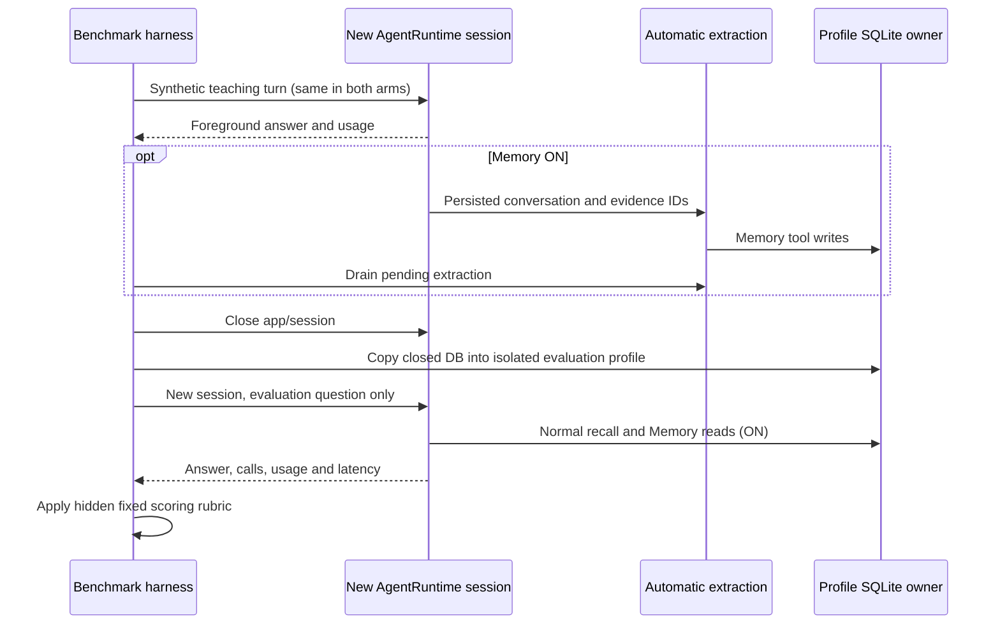

# Shared experience memory: utility benchmark

## Purpose

The integration suite checks persistence, evidence, isolation and runtime wiring with a
scripted model. Its token counts and answers are fixtures, not evidence of model quality.
This separate, opt-in benchmark measures actual model behavior through `createZCodeApp`.
It must never run automatically in CI or expose provider credentials in its reports.

## Protocol (version 1)

- Compare memory ON and OFF using the same provider, model, reasoning option and prompts.
- Use two independent synthetic replicas by default. Counterbalance arm order, retain
  every failure, and freeze fixtures and scoring before observing the results.
- Each arm receives identical teaching turns. Only ON performs automatic extraction;
  the foreground teaching turn cannot call Memory. Drain extraction before closing.
- Open a new app/session for every teaching and evaluation turn. Maintain a stable
  workspace identity and profile for learning, then copy only the closed memory database
  into a fresh evaluation profile. No prior transcript, fixture file or grading key is
  available to the answering agent. Evaluation never updates the learning profile.
- Main agents and extraction use the real configured model adapter. No scripted answers,
  manual memory insertion or direct provider calls may contribute to the A/B score.
- Permit only Memory during evaluation, disable unrelated plugins, MCP, workflows and
  subagents, and disable extraction during evaluation. The model still uses normal runtime
  recall, tool execution and prompt assembly. Record attempted writes and reject those cases.
- Score JSON answers against exact, predeclared synthetic facts. Report malformed answers,
  operational errors and missing provider usage separately; do not silently drop them.
- Measure foreground and extraction calls, provider-reported token usage (including cache
  and reasoning when supplied), wall time through extraction drain, and stored records.
  Failed requests without usage make cost totals incomplete, not zero-cost successes.
- Bound requests and total model calls. Authentication failure blocks the model benchmark;
  it must not be replaced with a fabricated A/B score or fixture token accounting.

## Acceptance cases

1. Recover the earlier repair and its cause in a fresh session.
2. Recover an explicitly portable user preference from another project.
3. After a user reports recurrence, stop describing the incident as confirmed fixed.
4. After a configuration correction, use the latest value, not the old value.
5. Refuse to disclose project-only knowledge from a different project.
6. Abstain on a fact never supplied.
7. Recover the relevant incident from a paraphrased question.
8. Answer a self-contained control question despite unrelated stored memories.



## Interpretation

This is a small synthetic memory pilot, not a coding benchmark, an Engram comparison,
or a reproduction of a published benchmark. Arbitrary historical facts intentionally
cannot be inferred by a fresh OFF session. A gain demonstrates useful persistence and
retrieval under these conditions, not general productivity or cheaper coding.

The dimensions follow the primary research questions of
[LongMemEval](https://arxiv.org/abs/2410.10813) and
[LongMemEval-V2](https://arxiv.org/abs/2605.12493): extraction, updates, temporal state,
abstention and applicable prior workflows. Their published scores are not ZCode scores.
Do not infer statistical generalization from two synthetic replicas. Report exact counts
and costs, with all limitations and any unavailable validation.

## Running the evaluation

Use the Node version pinned in `mise.toml` and build the CLI workspace dependencies
before running against changed runtime code. Commands below start at the repository root.

```sh
pnpm --dir apps/zcode-cli --filter @zcode/bootstrap memory:benchmark:typecheck
pnpm --dir apps/zcode-cli --filter @zcode/bootstrap memory:benchmark:integration
pnpm --dir apps/zcode-cli --filter @zcode/bootstrap memory:benchmark:retrieval --output /tmp/memory-retrieval.json
```

The integration command runs a deterministic HTTP provider bound to loopback. It checks
real adapter calls, automatic extraction, persisted/copyable memory, a new ON/OFF session,
unchanged evaluation snapshots, usage attribution and grading. Its answers and token
counts are deliberately simulated and cannot be used as a model-quality score.

The live evaluation requires both `ZCODE_BUILTIN_PROVIDER_CONFIG_FILE` and
`ZCODE_PERSONAL_PROVIDER_CONFIG_FILE` to point to existing ZCode provider configuration.
It reads these through the normal registry and never copies credentials into a report.
Select an available model and reasoning option explicitly:

```sh
pnpm --dir apps/zcode-cli --filter @zcode/bootstrap memory:benchmark \
  --provider PROVIDER_ID --model MODEL_ID --reasoning OPTION \
  --replicas 2 --output /tmp/memory-utility.json
```

Each report contains the runtime commit, benchmark source hash, all observed cases and
provider-reported usage. `blocked` means learning/setup did not finish; `incomplete` means
some requests, usage or isolation checks failed. Neither status is a completed utility
benchmark. Foreground wall time, time waiting for extraction drain, and extraction model
time are separate observations and may overlap. Individual SQLite-tool latency is not
instrumented. Raw provider headers, endpoints and error bodies are intentionally excluded.

## Retrieval diagnostic (separate score)

An offline diagnostic may insert synthetic records through `SqliteMemoryStore`, close and
reopen SQLite, then measure recall@6, reciprocal rank and query latency against a fixed
corpus with distractors. It must distinguish keyword, Spanish paraphrase and cross-language
queries, and check project/user visibility and superseded records. This tests the retrieval
component only: manually inserted records do not demonstrate automatic learning, agent
success, provider token savings or superiority to another memory product. Publish all
questions and expected IDs, including misses, so the score can be independently audited.
