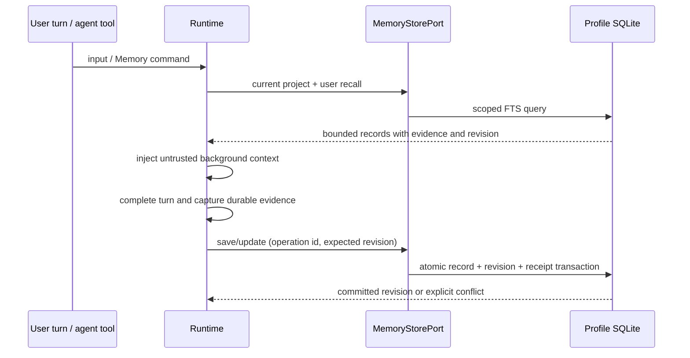

# Shared experience memory

## Product contract

ZCode retains useful experience across sessions and agents: the problem, attempted
resolution, why it was chosen, applicability, evidence, and subsequent feedback.
This is retrieval and revision of experience, not training model weights.

The same profile owns one memory database. `project` records are visible to all
sessions and agents of that exact workspace identity. `user` records are portable
knowledge shared across that user's projects. Retrieval combines the current
project and user scopes; it never silently retrieves another project's private
records. Project identity is `workspaceIdentity?.trim() || workspaceRoot`, never
the mutable shell cwd. The storage root is the existing CLI user profile root.

The agent explicitly selects user scope for portable preferences or methods and
records preconditions. Portable knowledge is shared by default without asking for
the same sharing preference in every session. Repository-specific paths, configuration and diagnoses stay
project scoped. User scope is local to the profile; cloud/account replication is
not implied.

## Owner and boundaries

`MemoryStorePort` is the public authority contract. A SQLite adapter owns current
records, immutable revisions, lexical search and mutation receipts. Core owns
evidence validation and relevance selection. Bootstrap opens/closes the adapter
and injects the same port into main, subagent and workflow runtimes. CLI, TUI and
Desktop use that runtime; clients do not maintain a second memory truth.

## Records and transitions

Kinds are episode, fact, procedure and preference. Each record has a stable topic,
title, summary and optional problem/resolution/rationale/applicability fields.
Outcomes distinguish recorded, attempted, tests_passed, user_confirmed, failed and
recurring. A successful tool execution is evidence of that execution only; it does
not prove overall product correctness. User confirmation requires a verbatim
reference to a real user message. The runtime validates the referenced message,
role and quote; the model remains responsible for interpreting its meaning.
Synthetic subagent instructions cannot manufacture user confirmation.

Updates append a revision and evidence; they do not erase prior attempts. A
recurrence changes the outcome to recurring so retrieval warns against treating
the old fix as established success. A new approach must explicitly transition
back to attempted before new verification. Changing a verified record's content
invalidates its former verification. A new success claim requires newly supplied,
validated evidence and cannot recycle a source already credited to an older
revision. Superseding an entry records an atomic
link and removes it from default recall. Optional reviewAfter marks stale material
for revalidation; it does not silently delete it. Forget is an explicit hard purge
of the record, revisions, search data and receipts containing it.

Every mutation carries an operation ID scoped to its session. Identical retries
return the original result; reuse with different content fails. Updates require an
expected revision; simultaneous agents cannot silently overwrite each other.
Duplicate active scope/project/topic saves return a conflict with the existing
record ID. Callers read and reconcile, never retry blindly with last-write-wins.
Purging may retain an opaque operation hash tombstone, containing no remembered
text, to prevent replay of a forgotten write from resurrecting its content.

## Runtime behavior

The `Memory` tool provides search, get, history, save, update and forget. Runtime
derives project/session/agent provenance; the model cannot select an arbitrary
user or project identity. Schemas enforce bounded input/output. Retrieved memory
is data, never authority to execute commands or override user/system instructions.
It must not contain hidden reasoning, credentials or full raw tool transcripts.

Recall runs at the start of each user turn and sees revisions written by other
sessions. Search uses SQLite FTS5, with bounded tokenization and literal matching;
there is no claimed embedding or semantic search. Empty queries return recent
records. A compact projection is injected; full content and bounded recent
evidence/history are fetched on demand. Failed and recurring experiences remain
searchable as warnings.

The existing after-turn extraction lifecycle writes through the same Memory tool
and validates evidence against durable messages. Short real-user confirmations
must not be skipped by a minimum-word heuristic. Extraction does not interpret a
completed model turn as a confirmed fix. It has no source-code or shell write
capability. Explicit memory tools work when automatic extraction is disabled.
Coalesced work is consumed in bounded batches, with limited earlier context. The
cursor advances only over the batch actually processed; a failed write preserves
that boundary for retry instead of silently skipping older pending evidence.
Ordinary headless CLI execution also enables extraction and gives it a bounded
drain before closing; the explicit memory benchmark mode retains its full drain.

Existing Markdown memories remain available as user-authored reference files.
The old automatic Markdown writer is replaced when the structured store is
available; no concurrent automatic writers maintain two versions of one record.
Existing agent profile instructions remain references, not a second experience
store. No destructive conversion of existing user files occurs.

## Storage and rollout

Use a separate versioned `memories/experience.sqlite` under the profile root.
Existing session database schema and user Markdown are unchanged. WAL,
transactions, a bounded busy timeout, parameterized SQL and compare-and-swap
protect concurrent processes. Adapter APIs are async and use existing SQLite
adapter conventions. No new network dependency or environment variable is added.
Disabling memory prevents registration, recall and extraction. Failures are
observable and never returned as successful saves.

## Using the feature

Memory is enabled by the existing `features.memory` and `memory.use` settings.
With either disabled, the runtime does not expose the tool or recall experiences.
There is no additional server or API key to configure. The selected model performs
the bounded after-turn extraction using only the Memory tool.

Users can ask the agent to remember a repair and its rationale, retrieve earlier
attempts, revise an incorrect observation, or forget a record. The tool returns a
record ID and revision; edits use that revision to detect concurrent changes.
Explicit user feedback such as a confirmed repair or a recurring error becomes
new evidence, with the original attempt retained in history. Whether a quote
actually confirms a specific repair still requires model interpretation.

CLI, TUI and Desktop use the same runtime capability and normal tool-result
presentation. This change does not add a separate graphical memory browser.
Cross-project sharing is within the same local profile. It does not synchronize
different machines or train model weights. Search is lexical; it can miss relevant
experience expressed with different vocabulary.

## Acceptance: integration, not isolated coverage counts

1. Session A saves an attempted repair with rationale; session B and a child agent
   recall it from the same project after closing/reopening the adapter.
2. Tool evidence supports tests_passed; fabricated/missing user evidence fails.
   A real user confirmation adds a revision; a later recurrence invalidates the
   success recommendation while preserving the earlier evidence.
3. A portable user procedure is visible in another project. Project-only records
   and direct ID lookups remain isolated, including remote workspace identities.
4. Concurrent writers produce one committed update and one explicit conflict;
   mutation replay is idempotent and a changed-payload replay fails.
5. Superseded, forgotten and due-for-review records follow the above recall rules.
6. A deterministic model runtime integration exercises Memory tool calls and the
   next session's actual model context; no external provider success is inferred.
7. CLI/root typecheck, lint, architecture and product build pass. Existing runtime
   integration checks cover common CLI/TUI/Desktop execution contracts.

## Research basis and limits

- [Engram v2](https://github.com/Gentleman-Programming/engram/tree/v2.0.0): structured
  notes, SQLite FTS5, stable topics and progressive retrieval.
- [A-MEM](https://arxiv.org/abs/2502.12110): atomic experiences and evolving links;
  ZCode keeps immutable revisions instead of silently replacing evidence.
- [Mem0](https://arxiv.org/abs/2504.19413): explicit add/update/no-op decisions.
- [LongMemEval](https://arxiv.org/abs/2410.10813) and
  [LongMemEval-V2](https://arxiv.org/abs/2605.12493): temporal updates, abstention,
  procedural retrieval and gotchas. V2 is work in progress, not a coding guarantee.
- [Hindsight](https://arxiv.org/abs/2512.12818): distinguish observations,
  experiences and beliefs.
- [MERIT](https://arxiv.org/abs/2608.05906): retain successful and failed repair
  episodes; its SQL correctness oracle is stronger than partial tests/user reports.
- [Memory-enabled multi-agent learning](https://arxiv.org/abs/2604.03295): evaluate
  sharing and procedure reuse rather than assuming more agents improve results.

The supplied independent five-layer playbook informs working/episodic/semantic/
procedural memory and forgetting. Its advertised cost reductions are not ZCode
benchmarks. This feature makes no quantified accuracy, token or latency claim.
