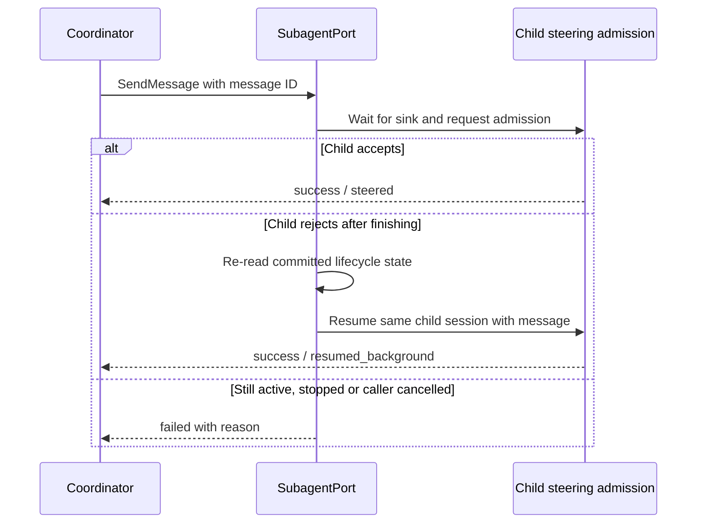

# Subagent message admission

## Ownership and contract

`SubagentPort` routes coordinator messages to the current child execution. The
existing task registry owns task identity and status, and the child runtime's
steering admission decides whether a running turn accepted the message.

- A successful delivery must name an actual admission: steering accepted by
  the child or a new background execution started with that message as input.
  A rejected sink must never produce a successful `queued` acknowledgement.
- Startup installs a per-execution deferred sink immediately. Sending while the
  real sink is being installed waits for admission instead of acknowledging an
  orphan queue. Waiting ends on sink readiness, terminal state or caller abort;
  terminal waiters and abort listeners are removed when the wait ends.
- An explicit non-admission rejection is followed by a fresh task read after pending lifecycle
  commits. If the child completed or failed, the existing resume path starts
  the same child session once with the original message ID and text. If another
  sender already resumed it, delivery is attempted once on that current
  execution instead of independently restarting the child.
- An accepted stop prevents an earlier in-flight message from automatically
  restarting the child. A new explicit send to a stopped child can still resume
  it through the existing terminal-task path.
- If a worker exits before installing its receiver, pending sends wait for its
  terminal commit before deciding whether to resume. Receiver closure alone
  must not be mistaken for a still-active child rejecting the message.
- If the child is still active but rejects admission, or the caller is aborted,
  the tool returns an explicit failure. It does not claim that a later tool
  round will consume the message.
- A thrown persistence or publication error is not proof of non-admission:
  steering may already have inserted the message. Only an explicit rejection
  from steering, or a channel that never invoked its receiver, permits recovery.
  Ambiguous failures return failure without replaying a potentially accepted
  message; successful admission is not retried because the child later ends.
- Neither waiting for sink readiness nor awaiting steering holds the lifecycle
  serializer. Stop and finalization remain able to make progress.
- These acknowledgements confirm admission, not that the model has already read
  or acted on the message. They do not add crash recovery or a persistent inbox.

The CLI, TUI, Desktop and Web continue using the same core path and existing
protocol result schema. No frontend-owned queue or compatibility route is added.

## Acceptance

Integration scenarios exercise the real runner, task registry and temporary
artifacts with controlled worker/sink boundaries:

1. A send whose sink rejects after child completion resumes the same session
   with the original message, rather than losing an acknowledged queued input.
2. A send during startup waits for the actual sink and reports its admission.
3. A running child that rejects returns failure, with no orphan pending message.
4. Cancelling a startup send settles it without later delivering that message
   when the sink eventually appears.
5. A send rejected after stop does not restart the child; a subsequent explicit
   send can resume the same session.
6. Exiting before receiver installation settles waiting sends after the
   terminal commit, without an orphan queue or an early false failure.
7. Concurrent messages reuse one resumed execution and preserve each original
   message ID, including a rejection from the previous execution's receiver.
8. An error after steering admission does not replay the message into a resumed
   execution, even if the child has already finished.

Existing foreground/background parent-child flows and the terminal coordination
integration scenarios must continue to pass.
