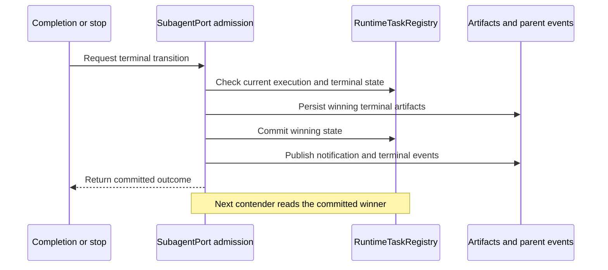

# Subagent terminal coordination

## Scope and owner

`SubagentPort` owns admission of local-agent lifecycle operations. Its existing
`RuntimeTaskRegistry` remains the sole owner of task status. Artifact files,
parent notifications and events are projections of that status. This change
does not introduce another task queue, a database migration or a new protocol.

## Terminal transition rules

- Completion, execution failure and explicit stop are serialized per agent.
  The first admitted terminal transition finishes its artifact writes, commits
  status and submits its notifications/events before a competing transition
  inspects the task again. Waiting for event subscribers happens outside
  admission, so a subscriber can issue a stop without deadlocking the owner.
- A stop racing with an already admitted completion returns the completed task;
  it must not acknowledge cancellation and later publish completion.
- An accepted stop is terminal for that execution. Late success or failure must
  not overwrite its status, output files or notification.
- Repeated stop calls return the same terminal result without duplicate events.
- Resuming a terminal child uses the same admission boundary. Each execution is
  identified by its existing run trace span; an old execution cannot finalize
  or install a message sink into a newer execution with the same agent ID.
- The operation serializer owns ordering only. It does not store an alternative
  task status, and it never covers the child's model/tool execution.
- A resumed child's startup acknowledgement is awaited outside admission and
  responds to cancellation. A failed startup restores the old snapshot only
  while the failed execution is still the current running generation.
- Publication errors after a terminal commit are reported as warnings; they do
  not change committed task success into a tool failure or restore running.
- Failed persistence releases admission and propagates the existing error.
  Existing notification failure handling must not restore a snapshot over a
  different execution or a concurrently committed terminal transition.

Desktop continuous and Web replayable delivery consume the same committed
events. This fix changes their common runtime owner, not either transport or UI.

## Acceptance

Integration scenarios use the real runner, task registry and temporary artifact
files, with barriers at the asynchronous worker or filesystem boundary:

1. Completion starts writing before a concurrent stop: one completed state,
   matching metadata/output, one completion notification and terminal event.
2. Stop starts first: late completion and late failure retain the stopped
   artifacts and killed state, with no conflicting notification/event.
3. Concurrent stops publish one outcome; stopping and then resuming a child
   prevents the old execution from modifying the new run.
4. A resumed child stalled before readiness can be stopped; an event subscriber
   can await stopping the same child without blocking terminal publication.

Normal foreground and background execution retain their existing behavior.
