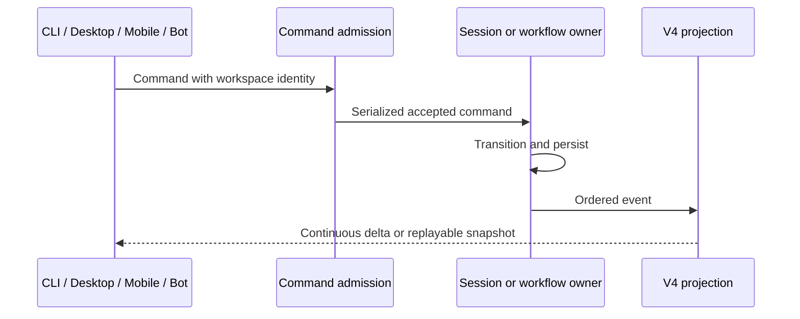

# Official v3.14.3 integration

## Scope and ownership

Integrate official commit `29628c9` into `main`, then merge `main` into
`feature/live-capability-runtime`, retaining both histories and all existing
Spanish localization, live capability, memory and subagent behavior.

The modular implementations on the feature branch remain the state owners.
Official changes to a former monolithic entrypoint must be applied to its
current implementation module; entrypoints remain facades.

## Required behavior

- Built-in workflow skills are resolved independently of plugin installation,
  while capability reload retains those roots and its serialized admission.
- Headless workflow tools require `--enable-workflow`. The skill loading gate
  uses the current session history and must not gate sessions without a skill port.
  Its presence follows the adopted runtime SkillPort, including enable/disable
  changes during a session, rather than the dependencies captured at startup.
- Workflow concurrency retuning, active duration, quiescence and task notifications
  use the existing run owner and task registry. They do not add another terminal
  state writer or reintroduce the fixed subagent cancellation/message races.
- V4 workflow deltas retain sequenced delivery, tombstones and throttled index
  fanout. Desktop continuous and mobile replayable delivery share the same owner.
- Bot delivery targets and V4 session creation reach the existing command path,
  including MCP configuration and workspace identity.
- Experience memory, extraction completion and replay receipts remain intact.

## Acceptance

Run root typecheck, lint and architecture validation on both merges. Run the
CLI workspace typecheck on main. On the feature branch run the complete existing
live-capability integration gate, including CLI builds and native SEA acceptance.
Add integration coverage only where the merge introduces a behavior intersection
that existing scenarios do not cover. Independently review the resolved changes
before publication. Both branches must contain the official commit and retain
their original branch tips in their history; no force push is allowed.

## Validation evidence (2026-09-25)

- Official `main` remained at `29628c9` after a second fetch at completion.
- Local `main` integration: `feb17bc`. Root typecheck, lint, changed architecture
  validation and all 27 CLI typecheck/build dependency jobs passed. The UI
  translation conflict was formatted and checked.
- Feature integration: complete `pnpm verify:pre-push` passed under Node
  24.14.0 and pnpm 10.33.2, including both typecheck/lint scopes, full
  architecture validation, CLI builds, a freshly built Linux x64 SEA and
  126 tests across eight package groups, with zero failures or skips.
- The new integration first reproduced an incorrectly accepted workflow
  snippet after enabling skills in a running session. The fixed executor
  checks the current SkillPort on each call; the same scenario then passed,
  including actual sandbox execution, skill discovery after reload and loading
  the bundled skill in an actual child runtime.

Dependencies were installed from the root workspace's frozen lockfile. Validation
used the pinned Node and root executable paths, with
`pnpm_config_verify_deps_before_run=false` to avoid pnpm attempting separate
installs against the nested CLI lockfile during checks. No validation phase was
omitted. Lint retained warnings (70 in the root scope) and reported zero errors.
These checks validate the integrated runtime; they do not establish a manual
Desktop UI acceptance or live third-party bot-provider acceptance.

The independent review of conflict resolutions and relevant upstream
intersections completed without outstanding material findings.
